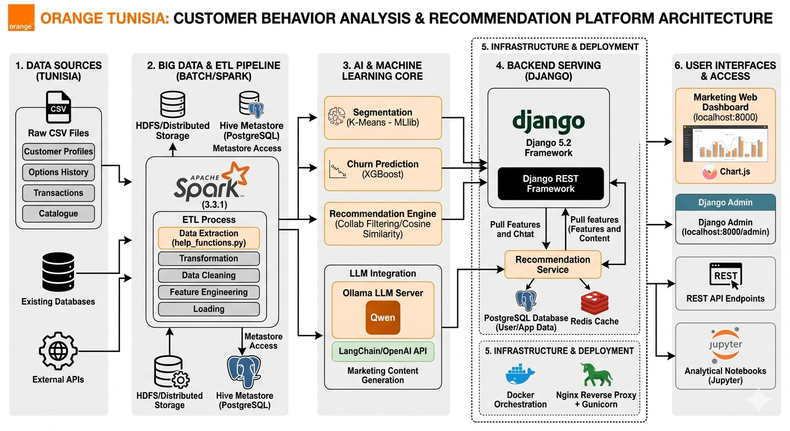

# Customer Behavior Analysis & Personalized Recommendation Platform - Orange Tunisia

## 🎯 Objective

This advanced analytics platform enables understanding of Orange Tunisia customer behavior and provides personalized recommendations. It 
aims to design an intelligent platform for analyzing Orange Tunisia customer behaviors, predicting churn, and automatically recommending personalized offers, particularly through the Max It application. It aligns with the operator's digital transformation strategy, focusing on marketing personalization and customer engagement optimization.It combines big data, machine learning, and AI techniques to deliver actionable insights to marketing teams.

---

## 📌 Project Objectives

### Business Objectives
- Analyze multi-channel behaviors (Max It, USSD...)
- Dynamically segment customers
- Predict churn
- Recommend personalized offers
- Generate adapted marketing messages
- Assist marketing teams with interactive dashboards

### Technical Objectives
- Distributed Big Data architecture
- AI models for segmentation, churn, recommendation
- LLM integration for marketing content generation
- Dynamic decision-making dashboards
## 🏗️ System Architecture

The following diagram illustrates the complete architecture of the Customer Behavior Analysis & Personalized Recommendation Platform, including the Big Data ETL pipeline, AI/ML components, Django backend services, deployment infrastructure, and user interfaces.

<p align="center">
  
</p>

### Architecture Overview
- **Data Sources**: Customer profiles, transactions, options history, and external APIs
- **Big Data & ETL**: Apache Spark, HDFS, Hive Metastore, distributed processing
- **AI & ML Core**:
  - Customer Segmentation (K-Means)
  - Churn Prediction (XGBoost)
  - Recommendation Engine
  - LLM-based marketing generation using Qwen + LangChain
- **Backend Services**:
  - Django REST Framework
  - PostgreSQL
  - Redis cache
- **Deployment & Infrastructure**:
  - Docker
  - Nginx + Gunicorn
- **User Interfaces**:
  - Marketing Dashboard
  - Django Admin
  - REST APIs
  - Jupyter Analytical Notebooks
---

### Available Interfaces
After launching services, several interfaces are available:

#### Marketing Web Interface (`marketing_dashboard`)
Accessible via browser at [http://localhost:8000](http://localhost:8000)
→ Dashboards, segment visualization, churn scores, marketing message generation, interactive reports, KPIs, etc.

#### Django Admin Interface
Accessible via [http://localhost:8000/admin](http://localhost:8000/admin)
→ User management, model administration, access rights, advanced platform administration.

#### REST API
→ For integration or automation (specific endpoints to be documented).

#### Analytical Notebooks Access
→ For data scientists wishing to execute or adapt notebooks like `prep_hive.ipynb` (environment-dependent).

### 🖥️ Web Interface – `marketing_dashboard`
The Django `marketing_dashboard` application provides a complete web interface for marketing teams and administrators. It offers:

- **Customer Analysis**: Detailed customer file (history, behaviors, scores, personalized recommendations)
- **Segment Analysis**: Customer segment exploration, advanced filters, reports, group recommendations, marketing message generation for segments
- **Segmentation Analysis**: Interactive cluster/segment visualization, global statistics, group evolution
- **Churn Analysis**: Access to churn scores, at-risk customer lists, targeted retention actions
- **Tables**: Access to data tables (customers, options, histories), search and export
- **Marketing History**: Campaign tracking, click-through rates, conversions, message logs
- **Authentication**: Secure access management (login, role and access rights management)

Access is via browser after starting the Django server (default http://localhost:8000). The interface is responsive and designed for quick adoption by business teams.


## 🧠 Models and Artificial Intelligence

### Segmentation Model
- **Algorithm**: K-Means (MLlib)
- **Input Features**: Usage patterns, revenue, engagement metrics
- **Output**: Customer segments with behavioral characteristics
- **Validation**: Silhouette score, business domain validation

### Churn Prediction Model
- **Algorithm**: XGBoost
- **Features**: Historical usage, recent changes, complaint patterns
- **Output**: Churn probability (0-1 scale)
- **Performance**: AUC-ROC > 0.85 target

### Recommendation Engine
- **Algorithm**: Cosine similarity + collaborative filtering
- **Features**: Purchase history, usage patterns, segment preferences
- **Output**: Ranked list of personalized recommendations
- **Evaluation**: Precision@K, recall@K metrics

### LLM Integration
- **Model**: Qwen via LangChain, Ollama
- **Purpose**: Marketing content generation
- **Applications**: Personalized messages, campaign copy
- **Fine-tuning**: Domain-specific marketing language

---

## 🛠️ Technical Platform

### Django Application
- **Backend**: Web framework, user management, dashboards
- **Location**: `client_behavior_platform/`, `marketing_dashboard/`
- **Features**: Customer analysis, segment exploration, churn monitoring

### Ollama LLM Server
- **Purpose**: Local LLM serving for text generation
- **Script**: `start_ollama.sh`
- **Integration**: LangChain for structured prompts

### Docker Orchestration
- **Files**: `Dockerfile`, `docker-compose.yml`
- **Services**: Web app, database, Spark cluster, Redis
- **Benefits**: Consistent deployment, scalability

### Big Data Stack
- **Spark**: Distributed data processing
- **Hive**: Data warehouse with metastore
- **Hadoop**: Distributed storage (optional)
- **Integration**: Docker-based deployment

## ✨ Key Features

### 📊 Marketing Dashboard
- Real-time KPI visualization
- Advanced customer segmentation
- Marketing campaign tracking

### 🤖 Artificial Intelligence
- Customer churn detection
- Personalized recommendation system
- Predictive behavior analysis

### 📈 Advanced Analytics
- Massive data processing with Apache Spark
- Customizable reports
- Analysis export in multiple formats

## 🏗️ Architecture
- **Frontend**: HTML5, CSS3, JavaScript, Chart.js
- **Backend**: Django 5.2, Django REST Framework
- **Database**: PostgreSQL
- **Data Processing**: Apache Spark, Pandas
- **Machine Learning**: Scikit-learn, XGBoost
- **AI**: LangChain, OpenAI, Ollama

## 📋 Prerequisites

### Hardware
- Minimum 8 GB RAM (16 GB recommended)
- 20 GB available disk space
- 64-bit processor (4 cores minimum)

### Software
- Python 3.10+
- Java 11 (required for Apache Spark)
- PostgreSQL 13+
- Apache Spark 3.3.1
- pip (Python package manager)

## 🚀 Installation

### 1. Clone the repository
```bash
git clone https://github.com/your-user/spark_delta_hive_metastore.git
cd spark_delta_hive_metastore
```

### 2. Environment setup

#### 2.1. Create virtual environment
```bash
# On Linux/Mac
python -m venv venv
source venv/bin/activate

# On Windows
python -m venv venv
.\venv\Scripts\activate
```

#### 2.2. Install dependencies
```bash
# Install base dependencies
pip install -r requirements/requirements.txt

# Install Django application dependencies
cd client_behavior_platform
pip install -r requirements.txt
```

### 3. Database configuration

#### 3.1. PostgreSQL installation
- Install PostgreSQL 13+ from [official website](https://www.postgresql.org/download/)
- Create a new database

#### 3.2. Environment variables configuration
Create a `.env` file at the project root with the following content:
```
# Database configuration
DB_NAME=your_database
DB_USER=your_user
DB_PASSWORD=your_password
DB_HOST=localhost
DB_PORT=5432

# Django secret key (generate for production)
SECRET_KEY=your_very_long_and_secure_secret_key

# Spark configuration (optional)
SPARK_HOME=/path/to/your/spark/installation
PYSPARK_PYTHON=python3
```

### 4. Database initialization
```bash
# Navigate to Django project folder
cd client_behavior_platform

# Apply migrations
python manage.py migrate

# Create superuser (follow instructions)
python manage.py createsuperuser
```

## 🏃‍♂️ Running the Application

### 1. Development mode
```bash
# Navigate to Django project folder
cd client_behavior_platform

# Start development server
python manage.py runserver
```

Application will be available at: http://127.0.0.1:8000/

### 2. Production mode with Gunicorn
```bash
# Install Gunicorn (if not already done)
pip install gunicorn

# Launch Gunicorn (from client_behavior_platform folder)
gunicorn client_behavior_platform.wsgi:application --bind 0.0.0.0:8000 --workers 4
```

### 3. Web server configuration (Nginx + Gunicorn) - Optional for production

#### Nginx installation
```bash
# On Ubuntu/Debian
sudo apt update
sudo apt install nginx

# On CentOS/RHEL
sudo yum install nginx
```

#### Nginx configuration
Create a configuration file for your site in `/etc/nginx/sites-available/` (or `/etc/nginx/conf.d/` depending on your distribution):

```nginx
server {
    listen 80;
    server_name your-domain.com;

    location / {
        proxy_pass http://127.0.0.1:8000;
        proxy_set_header Host $host;
        proxy_set_header X-Real-IP $remote_addr;
        proxy_set_header X-Forwarded-For $proxy_add_x_forwarded_for;
        proxy_set_header X-Forwarded-Proto $scheme;
    }
    
    location /static/ {
        alias /path/to/your/project/client_behavior_platform/static/;
    }
    
    location /media/ {
        alias /path/to/your/project/client_behavior_platform/media/;
    }
}
```

#### Activate configuration and restart Nginx
```bash
# On Ubuntu/Debian
sudo ln -s /etc/nginx/sites-available/your-site /etc/nginx/sites-enabled/
sudo nginx -t  # Test configuration
sudo systemctl restart nginx

# On CentOS/RHEL
sudo systemctl enable nginx
sudo systemctl start nginx
```

## 📦 Main Dependencies

### Backend
- Django 5.2.4 - Python web framework
- Django REST Framework 3.16.0 - REST API for Django
- Psycopg2 2.9.10 - PostgreSQL adapter for Python
- Pandas 2.3.1 - Data manipulation
- Scikit-learn 1.7.1 - Machine Learning

### AI & Machine Learning
- LangChain 0.3.27 - Framework for LLM applications
- OpenAI 1.97.1 - OpenAI API
- Ollama 0.5.1 - Local LLM model integration
- XGBoost - Boosting algorithms

### Utilities
- NumPy 2.3.1 - Numerical computing
- SciPy 1.16.0 - Scientific tools
- Matplotlib 3.10.3 - Data visualization
- Requests 2.32.4 - HTTP requests
- python-dotenv 0.19.0 - Environment variable management
- Gunicorn 23.0.0 - Production WSGI HTTP server

---

## 🔄 ETL PIPELINE & DATA PROCESSING

### 📊 Data Sources

#### Input Data Files
- **Customer files**: `clients_*.csv` (profiles, usage, Max It history...)
- **Options files**: `options_*.csv` (subscribed options, purchase history...)
- **Transaction files**: 
  - `recharge_*.csv` - Customer recharge records
  - `achat_option_*.csv` - Option purchase records
  - `roue_chance_*.csv` - Wheel of fortune game records
- **Reference data**: `catalogue.csv` - Product and service catalog

#### Data Structure
```
data/
├── client_data/          # Raw customer data
├── segmentation_result/  # Segmentation results
├── churn_results/        # Churn analysis results
└── processed/           # Processed and cleaned data
```

### 🏗️ ETL Architecture

```
┌─────────────────┐    ┌──────────────────┐    ┌─────────────────┐    ┌──────────────────┐
│  Raw Data Sources│ -> │  Data Extraction │ -> │ Data Transformation│ -> │  Loading & Storage │
└─────────────────┘    └──────────────────┘    └─────────────────┘    └──────────────────┘
         │                       │                       │                       │
    CSV Files              Pandas/Spark           ML Processing        PostgreSQL/Django
    Database               Data Cleaning          Feature Engineering   API Endpoints
    External APIs          Validation             Segmentation         Dashboard Display
```

### 📋 ETL Process Steps

#### 1. Data Extraction (`help_functions.py`)
```python
# Key extraction functions:
- extract_volumes()          # Extract data, voice, SMS usage from descriptions
- generate_consommations()  # Generate daily consumption aggregations
- extract_month()           # Extract monthly periods for analysis
- extract_duree()           # Calculate option validity periods
```

#### 2. Data Transformation
- **Data Cleaning**: Remove duplicates, handle missing values
- **Feature Engineering**: Create behavioral features from raw transaction data
- **Aggregation**: Daily/monthly consumption summaries per customer
- **Normalization**: Standardize numerical features for ML models

#### 3. Data Loading & Processing
- **Database Storage**: Load processed data into PostgreSQL
- **ML Model Training**: Train segmentation, churn, and recommendation models
- **Real-time Processing**: Handle new transaction data through Django API

### 🤖 Machine Learning Pipeline

#### Customer Segmentation
- **Algorithm**: K-Means clustering (MLlib)
- **Features**: Usage patterns, revenue, engagement metrics
- **Output**: Customer segments with behavioral profiles
- **Implementation**: `script_analyse_segment.py`

#### Churn Prediction
- **Algorithm**: XGBoost classifier
- **Features**: Historical usage, recent activity changes, complaints
- **Output**: Churn probability scores per customer
- **Implementation**: `churn_analysis.py`

#### Recommendation System
- **Algorithm**: Cosine similarity + collaborative filtering
- **Features**: Purchase history, usage patterns, segment preferences
- **Output**: Personalized product recommendations
- **Implementation**: `script_analyse_client.py`

### 📊 Data Flow Examples

#### Customer Analysis Pipeline
```python
# 1. Load customer data
client_json, all_options, clients_df = filtrer_clients(
    msisdn, date_debut, date_fin, folder_path
)

# 2. Generate consumption patterns
consommation_client = dataframe_recommandations_vers_json_client(
    all_options, catalogue
)

# 3. Generate marketing recommendations
rapport_client = generer_rapport_marketing_client(client_json)
messages_options = generer_messages_options_client(
    options_list, consommation_client, all_options
)
```

#### Segment Analysis Pipeline
```python
# 1. Filter customers by segment criteria
result, all_options, clients_df, segment_id = filtrer_clients_par_segments(
    segment_criteria, date_debut, date_fin, folder_path
)

# 2. Build segment profile
profil_segment = construire_profil_segment(all_options)

# 3. Generate segment-level recommendations
rapport_segment, taux_maxit = generer_rapport_marketing_segment(
    segment_id, result
)
```

### 🔄 Batch Processing with Apache Spark

#### Spark Configuration
- **Version**: Apache Spark 3.3.1+
- **Integration**: PySpark for Python-based processing
- **Storage**: Hive metastore with PostgreSQL backend
- **Deployment**: Docker containers for scalability

#### Spark Jobs
- **Data Ingestion**: Process large CSV files in parallel
- **Feature Engineering**: Create ML features at scale
- **Model Training**: Train ML models on distributed datasets
- **Batch Scoring**: Generate predictions for all customers

### 📈 Real-time Processing

#### Django API Integration
- **Endpoints**: RESTful APIs for real-time customer analysis
- **Caching**: Redis for frequently accessed data
- **Background Tasks**: Celery for async ML processing
- **WebSocket**: Real-time dashboard updates

#### Data Freshness
- **Batch Updates**: Daily processing of new transaction data
- **Real-time Triggers**: Immediate processing of high-value events
- **Model Retraining**: Weekly model updates with new data

---

## 🐳 Docker Option (Optional)

### Prerequisites
- Docker 20.10+
- Docker Compose 2.0+

### Launch with Docker Compose
```bash
# Build and start containers
docker-compose up --build -d

# Stop containers
docker-compose down

# View logs
docker-compose logs -f
```

### Useful Commands
```bash
# Access main container shell
docker-compose exec web bash

# Run Django management commands
docker-compose exec web python manage.py migrate
docker-compose exec web python manage.py createsuperuser

# Restart specific service
docker-compose restart web
```

### Docker Configuration
The `docker-compose.yml` file configures the following services:
- **web**: Django application
- **db**: PostgreSQL database
- **redis**: Cache and queue (if configured)
- **spark**: Spark cluster (optional)

## 🌐 Access Points
- Web application: http://localhost:8000
- Marketing interface: http://localhost:8000/marketing-panel
- REST API: http://localhost:8000/api/


---

## 🚀 Deployment and Usage

### Prerequisites
- Docker / Docker Compose
- Python 3.10+
- Access to data files

### Quick Start
```bash
# Build and start services
sudo docker-compose up --build

# Start Ollama (LLM)
bash start_ollama.sh

# Start Django server
python manage.py runserver
```

### Available Interfaces
After launching services, several interfaces are available:

#### Marketing Web Interface (`marketing_dashboard`)
Accessible via browser at [http://localhost:8000](http://localhost:8000)
→ Dashboards, segment visualization, churn scores, marketing message generation, interactive reports, KPIs, etc.

#### Django Admin Interface
Accessible via [http://localhost:8000/admin](http://localhost:8000/admin)
→ User management, model administration, access rights, advanced platform administration.

#### REST API
→ For integration or automation (specific endpoints to be documented).

#### Analytical Notebooks Access
→ For data scientists wishing to execute or adapt notebooks like `prep_hive.ipynb` (environment-dependent).

### 🖥️ Web Interface – `marketing_dashboard`
The Django `marketing_dashboard` application provides a complete web interface for marketing teams and administrators. It offers:

- **Customer Analysis**: Detailed customer file (history, behaviors, scores, personalized recommendations)
- **Segment Analysis**: Customer segment exploration, advanced filters, reports, group recommendations, marketing message generation for segments
- **Segmentation Analysis**: Interactive cluster/segment visualization, global statistics, group evolution
- **Churn Analysis**: Access to churn scores, at-risk customer lists, targeted retention actions
- **Tables**: Access to data tables (customers, options, histories), search and export
- **Marketing History**: Campaign tracking, click-through rates, conversions, message logs
- **Authentication**: Secure access management (login, role and access rights management)

Access is via browser after starting the Django server (default http://localhost:8000). The interface is responsive and designed for quick adoption by business teams.

---

## 📊 Visualization & Dashboards
- Interactive dashboards in Django app (`marketing_dashboard/`)
- Power BI exports in `segmentation_result/` or `churn_results/`
- Web interface access for business teams

---

## 🗂️ Main Project Files

| File/Folder | Role |
|-------------|------|
| `Dockerfile` | Main Docker image |
| `docker-compose.yml` | Service orchestration |
| `start_ollama.sh` | LLM server startup |
| `marketing_analyst_bot.py` | LLM-based marketing message generation |
| `script_analyse_client.py` | Behavioral analysis and churn prediction |
| `script_analyse_segment.py` | Customer segmentation |
| `marketing_dashboard/` | Django app, dashboards |
| `requirements.txt` | Python dependencies |
| `help_functions.py` | Utility functions for ETL |
| `langchain.ipynb` | LLM integration / content generation |
| `prep_hive.ipynb` | Main ETL pipeline notebook |
| `data/`, `client_data/` | Input data |

---

## ✅ Expected Results & Impact

### Business Impact
- Increased Max It adoption
- Large-scale marketing personalization
- Churn reduction
- More effective targeted communication
- Better campaign allocation

### Technical Benefits
- Scalable data processing architecture
- Real-time customer insights
- Automated recommendation generation
- Integrated ML pipeline
- Comprehensive analytics platform

---

## 👥 Contact / Contributors
Project by Hadil Sahraoui as part of PFE at Orange Tunisia.

---

## 📚 Additional Documentation

### Data Schema Documentation
- Customer tables: Profile and demographic information
- Transaction tables: Purchase and usage history
- Option catalog: Product and service definitions
- Segment mappings: Customer segment assignments

### API Documentation
- Customer analysis endpoints
- Segmentation queries
- Churn prediction services
- Recommendation generation

### Monitoring & Maintenance
- Model performance tracking
- Data quality validation
- System health monitoring
- Backup and recovery procedures
